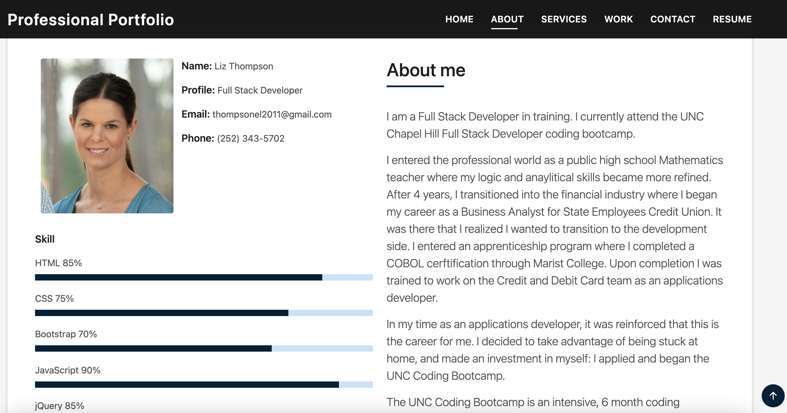
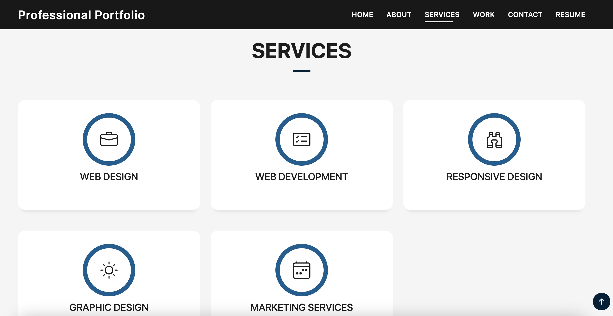
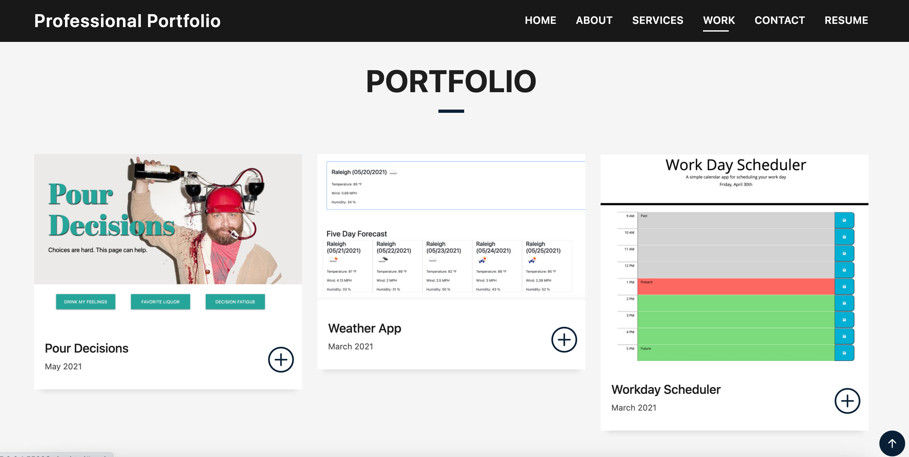
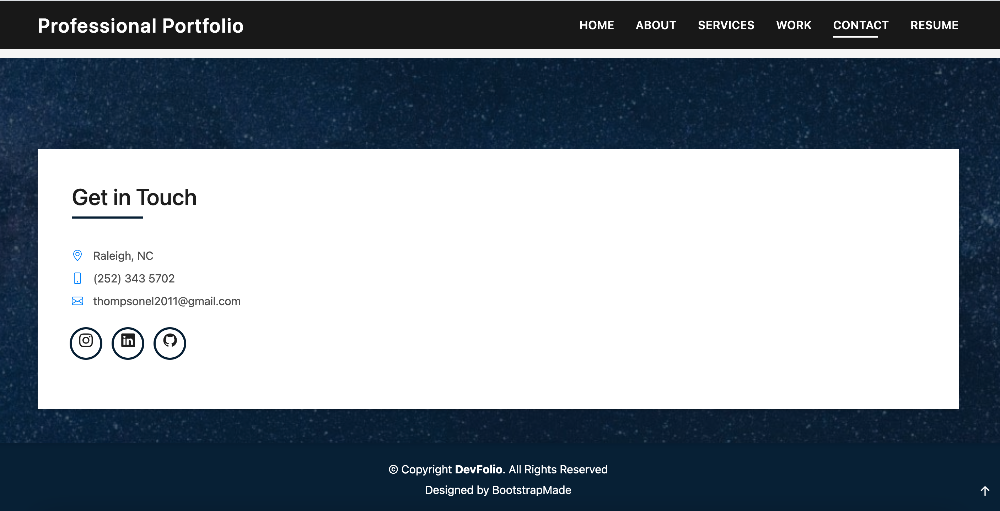
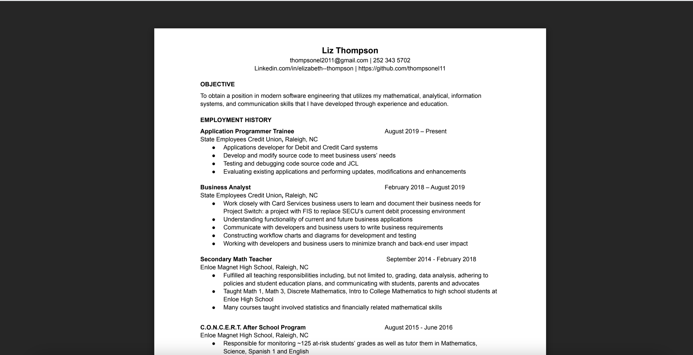

# Professional Portfolio

The purpose of this webpage is to create a professional portfolio to display work, services offered, contact information, and information about myself. 

## Navigation Bar

The navigation bar is located in the top, right portion of the webpage. When you select the "About", "Services", "Work", or "Contact" tabs, you will be directed to the corresponding content on the webpage.  When you select the "Resume" tab, you will be directed to a Google doc that contains a PDF of my resume.  

## About

The "About" (me) portion of this webpage contains a photo, contact information, job title, a brief description of how I got to this point in my profession, and a list of skills I have acquired through education and work experience. This portion of the webpage can be accessed by clicking on the "about" tab on the navigation bar in the top, right portion of the webpage. 

## Services

The "Services" portion of this webpage contains the professional services I offer as a web developer. The "Services" portion of this webpage can be easily accessed by selecting the "Services" tab on the navigation bar in the top, right portion of the webpage.  

## Work

The "Work" portion of this webpage contains three sample websites I have built. When the user selects the + button, he/she will be directed to the webpage. The "work" portion of this webpage can be easily accessed by selecting the "Work" tab on the navigation bar in the top, right portion of the webpage. 

## Contact 

The "Contact" portion of this webpage contains links to my LinkedIn, GitHub, and Instagram as well as my email, location, and phone number.  This portion of the webpage can be accessed by clicking on the "Contact" tab on the navigation bar in the top, right portion of the webpage. 

## Resume

The "Resume" tab on the webpage's navigation bar will direct you to a PDF version of my resume that is located in my Google docs. 

### Portfolio IO: 
https://thompsonel11.github.io/Portfolio/

### GitHub Portfolio: 
https://github.com/thompsonel11/Portfolio
